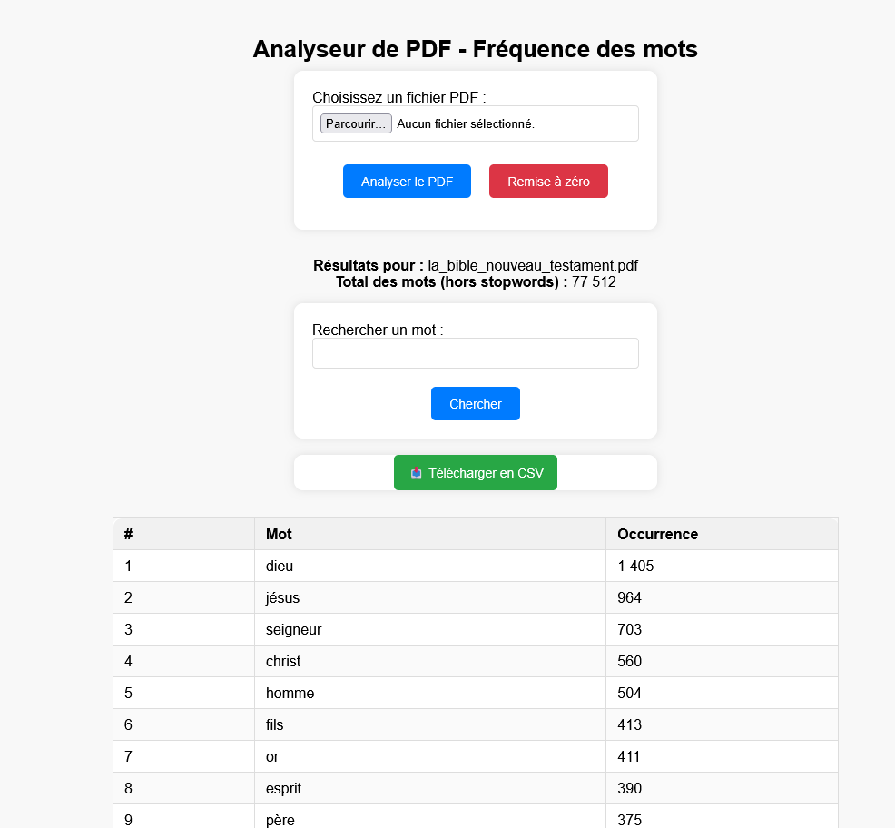

Script d’analyse du nombre d'occurences des mots dans un PDF v1.0 - 16/11/2025
## Usage

Idéal pour l'analyse textuelle, la recherche documentaire, ou l'étude de corpus textuels.

## Fonctionnalités principales

- **Upload de PDF**  
  Permet à l’utilisateur de téléverser un fichier PDF depuis son ordinateur.

- **Analyse automatique du contenu**  
  Extrait et analyse tous les mots présents dans le PDF.

- **Gestion UTF-8 complète** : Support des caractères accentués et normalisation Unicode

- **Gestion des mots ignorés (stop words)**  
  Ignore automatiquement les mots courants (ex. : le, la, de, etc.) lors de l’analyse pour se concentrer sur les mots significatifs.  
  ➔ **La liste des mots ignorés est facilement modifiable dans le script** pour l’adapter à vos besoins.

- **Gestion de session** : Conservation des résultats entre les recherches avec possibilité de remise à zéro

- **Comptage des occurrences**  
  Génère un tableau listant chaque mot distinct (hors mots ignorés) et le nombre de fois où il apparaît dans le document.

- **Affichage des résultats immédiats**  
  Affiche le tableau des mots et de leurs occurrences directement sur la page web, avec numérotation (par ordre décroissant).

- **Export au format CSV**  
  Permet de télécharger le tableau des résultats au format CSV pour une exploitation dans Libre Office, Excel ou autre tableur.

- **Recherche de mot**  
  Offre un champ de recherche pour saisir un mot précis et obtenir instantanément le nombre d’occurrences de ce mot dans le PDF analysé.

- **Interface claire et responsive**  
  Design responsive et centré avec animations de chargement, formulaires d’upload et de recherche, affichage des résultats, bouton de téléchargement.

- **Gestion sécurisée des fichiers**  
  Les fichiers PDF et CSV sont stockés dans un dossier dédié, avec gestion des erreurs de téléversement.

## Prérequis techniques

- PHP 7+ avec les extensions `mbstring` et `intl`
- Utilitaire `pdftotext` (paquet Poppler-utils) installé sur le serveur
## Installation
- **Téléchargez les fichiers dans un dossier dédié de votre serveur web**
- **Ouvrez un terminal dans ce dossier et lancer les commandes**
  
   ➔ composer install
  
   ➔ composer require smalot/pdfparser

## Licence

GPL - Logiciel libre et open-source

